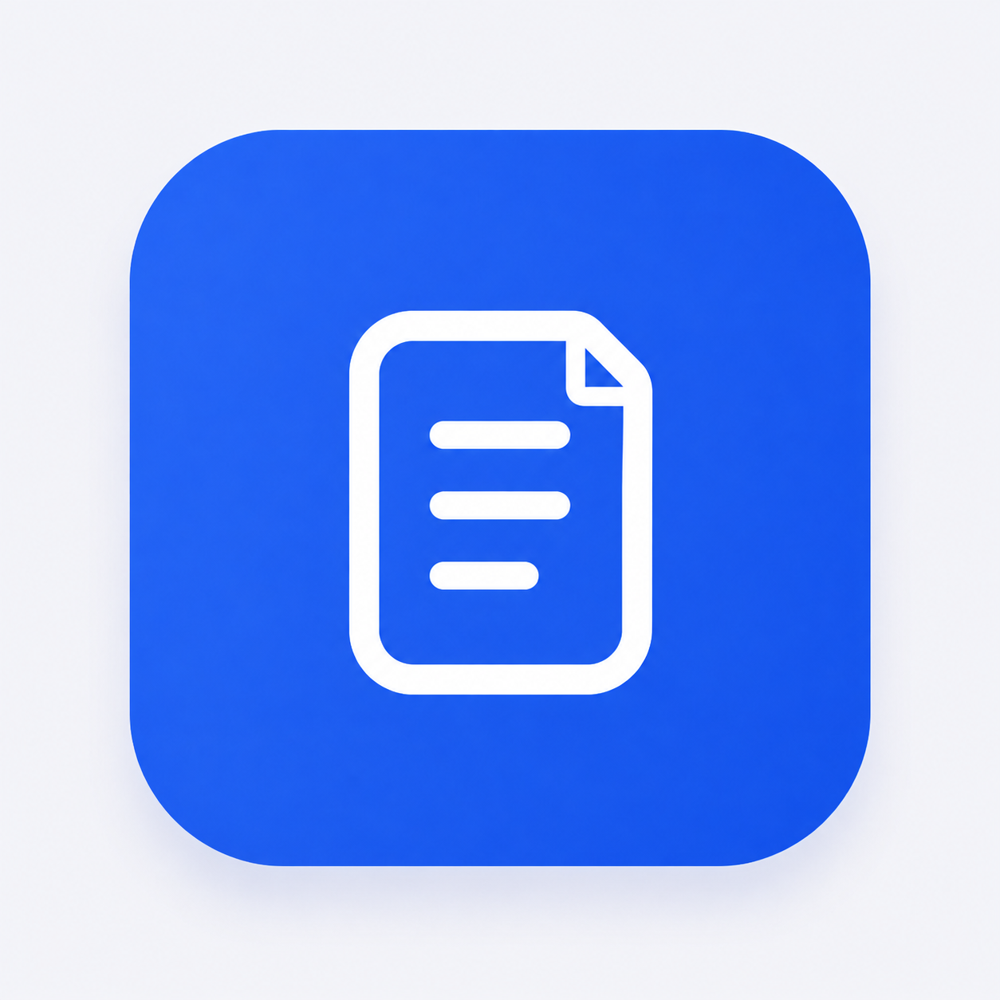
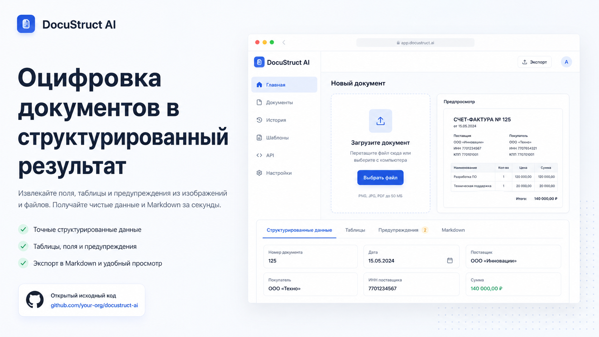
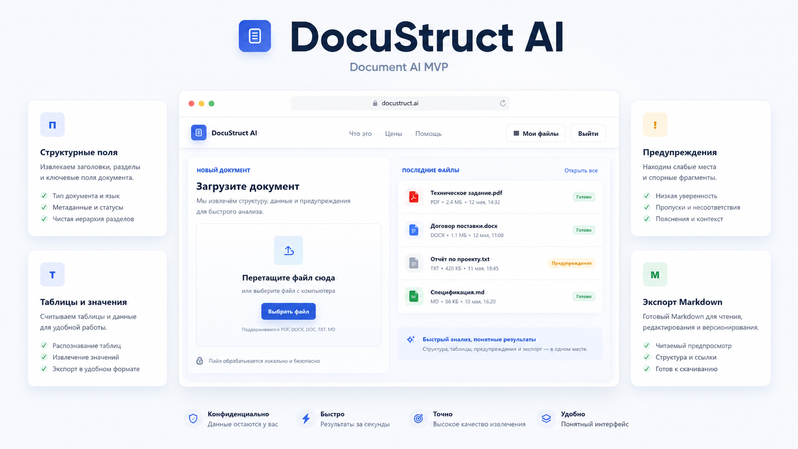
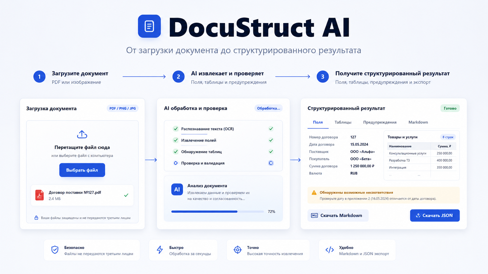
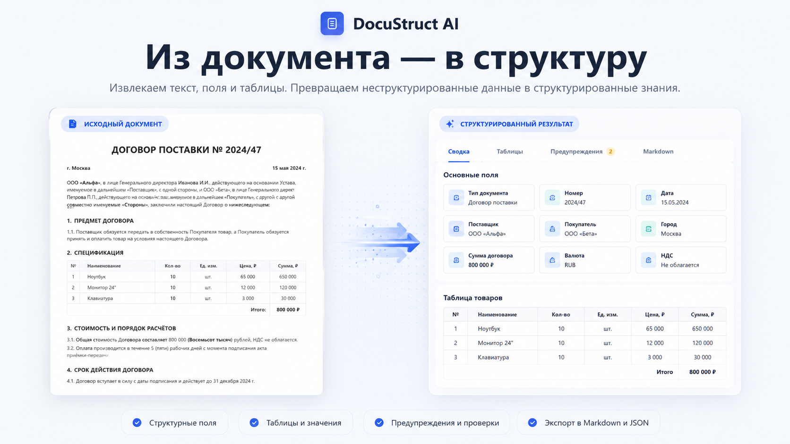

<p align="center">
  
</p>

<h1 align="center">DocuStruct AI</h1>

<p align="center">
  <strong>AI-инструмент для оцифровки документов и преобразования изображений в структурированный результат.</strong><br>
  Извлечение полей, таблиц и предупреждений, проверка результата и экспорт в удобном виде.
</p>


<div align="center">


</div>

---

## Обзор

`document-digitization-ai` — общедоступный MVP для оцифровки документов.
Он принимает загруженные изображения документов, запускает извлечение данных с помощью ИИ,
сохраняет состояние задачи и результата и предоставляет интерфейсы для проверки структуры,
предпросмотра и экспорта результата.

Проект развивается в открытом доступе как прикладной MVP, а не как готовый
SaaS-сервис для промышленной эксплуатации. README помогает понять его возможности,
локально запустить приложение и продолжить разработку.

## Визуальная концепция

> Изображения ниже — концептуальные рендеры, а не точные скриншоты текущего
> веб-интерфейса. Они показывают направление продукта и общий пользовательский
> сценарий; фактически реализованные возможности и ограничения зафиксированы в
> следующих разделах README.


<p align="center">
  [Смотреть видео](https://github.com/user-attachments/assets/b0e8d335-2986-4725-a828-bea599744766)
  <sub>Процесс</sub>
</p>

<p align="center">
  <br>
  <sub>1. Общее позиционирование: от документа к структурированному результату.</sub>
</p>

<p align="center">
  <br>
  <sub>2. Карта продукта: загрузка, история обработки, поля, таблицы, предупреждения и экспорт.</sub>
</p>

<p align="center">
  <br>
  <sub>3. Пользовательский сценарий: загрузка, AI-обработка и проверка результата.</sub>
</p>

<p align="center">
  <br>
  <sub>4. Итог цепочки: сопоставление исходного документа с извлечённой структурой.</sub>
</p>

## Возможности MVP

Текущие возможности MVP:

- серверная часть на FastAPI с фабрикой приложения `document_digitization_ai.api.http.app:create_app`;
- статический веб-интерфейс по адресу `/app`;
- загрузка изображения документа через веб-интерфейс или `POST /documents`;
- создание задачи обработки, периодическая проверка её статуса и история обработанных файлов;
- рабочая область результата с предпросмотром исходного файла;
- просмотр сводки, предупреждений, извлечённых значений, таблиц, текста и Markdown;
- экспорт в Markdown;
- экспорт в PDF;
- удаление задачи;
- политика хранения с настройкой по умолчанию 7 дней;
- безопасная выдача исходного загруженного файла через маршрут предпросмотра серверной части,
  включая режим скачивания.

Основным поддерживаемым типом входных данных следует считать изображения: надёжная текущая
формулировка — файлы изображений, которые Pillow может открыть и диагностировать.
PDF в веб-интерфейсе может отображаться как допустимый файл, но извлечение данных из PDF
пока не зафиксировано как гарантированная возможность.

## Не входит в текущий объём

В текущий MVP не входят:

- аутентификация, вход и учётные записи;
- оплата, квоты и подписки;
- изоляция данных между несколькими пользователями или многопользовательская модель с разделением данных;
- развёртывание в промышленной среде;
- универсальный просмотрщик артефактов;
- интерфейс для необработанного или очищенного JSON;
- просмотрщик или редактор PDF;
- полное восстановление исходной вёрстки;
- пакетная обработка;
- процесс ручной корректировки результата пользователем.

## Требования

Практические требования для локальной работы:

- Python `>=3.14` согласно `pyproject.toml`;
- `uv` для запуска команд и управления окружением;
- локальный `.env`, созданный на основе `.env.example`;
- секреты провайдера и медиасервиса нужны только при включении режима реального провайдера
  через OpenRouter и ImgBB.

Для стандартного локального сценария реальные внешние провайдеры не нужны:
по умолчанию используется детерминированный тестовый провайдер.

## Конфигурация

Начальная точка конфигурации — `.env.example`. Обычно локально создаётся `.env`
и редактируется под нужный режим:

```powershell
Copy-Item .env.example .env
```

Основные группы настроек:

- настройки провайдера: выбор `fake` или `openrouter`, URL и модель OpenRouter, а также политика работы LLM;
- настройки подготовки медиафайлов: `none` для локального сценария с тестовым провайдером
  или `imgbb` для получения публичного URL медиафайла;
- пути хранения: база данных SQLite, загруженные артефакты и артефакты результатов;
- ограничения загрузки: максимальный размер файла и пороговые значения диагностики изображения;
- срок хранения артефактов: по умолчанию 7 дней.

Секреты должны храниться только в локальном `.env`. Нельзя сохранять в репозитории реальные
ключи API, локальные учётные данные или артефакты, создаваемые во время выполнения.

## Локальный запуск

### Быстрый запуск в Windows

Для обычной работы достаточно дважды щёлкнуть по файлу `start-web.cmd` в корне проекта.
Его же можно использовать как цель ярлыка на рабочем столе.

Загрузчик:

- всегда запускает проект из правильного рабочего каталога независимо от расположения ярлыка;
- проверяет наличие локального `.env` и утилиты `uv`;
- проверяет, свободен ли порт `8000`;
- ждёт успешного ответа `/health` и только после этого открывает `/app/` в браузере;
- при повторном запуске открывает уже работающее приложение, не создавая второй сервер;
- оставляет окно сервера видимым для журналов и сообщений об ошибках.

Чтобы остановить приложение, закрыть окно сервера или нажать в нём `Ctrl+C`.
Если запуск завершится ошибкой, окно останется открытым до нажатия клавиши.

### Ручной запуск

Локальный сервер для ручной работы можно запустить так:

```powershell
uv run --with uvicorn uvicorn document_digitization_ai.api.http.app:create_app --factory --host 127.0.0.1 --port 8000
```

`uvicorn` предоставляется через `uv --with` как в этой ручной команде, так и в
`scripts/start_web.ps1`. Он пока не является прямой зависимостью `pyproject.toml`.

После запуска открыть:

```text
http://127.0.0.1:8000/app
```

Проверка работоспособности:

```text
http://127.0.0.1:8000/health
```

## Работа с веб-интерфейсом

Базовый локальный сценарий:

1. Открыть `/app`.
2. Загрузить изображение документа.
3. Дождаться завершения анализа.
4. Проверить результат в рабочей области.
5. Использовать `Мои файлы` для просмотра истории задач.
6. Открывать предпросмотр ранее обработанных файлов.
7. Скачать Markdown или PDF.
8. Удалить задачу, когда результат больше не нужен.

Веб-интерфейс служит оболочкой для возможностей серверной части. Извлечение данных,
проверка, хранение, политика работы провайдера и экспорт остаются ответственностью
серверной части.

## Экспорт

Экспорт в Markdown ориентирован на пользователя и очищен от внутренних данных.
Он предназначен для чтения, копирования или скачивания результата без внутренних
данных провайдера и отладочной информации.

Экспорт в PDF создаёт пользовательский файл, который серверная часть отдаёт
с типом `application/pdf`.

Экспорт по умолчанию включает пользовательские разделы: сводку, предупреждения,
поля и значения, таблицы и пользовательский текст. Он не должен раскрывать метаданные
извлечения, необработанные или очищенные ответы провайдера, внутреннюю отладочную
информацию, секреты, локальные пути, идентификаторы задач или попыток, а также
внутренние данные диагностики изображения.

## Хранение, предпросмотр, удаление и срок хранения

По умолчанию локальные данные размещаются в настроенных корневых каталогах хранения:

- база данных SQLite: `./data/app.db`;
- загруженные файлы: `./data/uploads`;
- результаты: `./data/results`.

Загруженные файлы и результаты извлечения сохраняются серверной частью. Предпросмотр
исходного файла выполняется через маршрут серверной части `GET /jobs/{job_id}/preview`,
а не через прямую раздачу произвольных путей файловой системы.

Необработанные, очищенные и отладочные артефакты провайдера могут существовать
во внутреннем хранилище, но не являются частью пользовательского интерфейса.
Универсальный маршрут API для скачивания произвольных артефактов в MVP не заявлен.

`DELETE /jobs/{job_id}` удаляет состояние задачи и безопасно очищает связанные
каталоги загрузок и результатов. Срок хранения по умолчанию равен 7 дням.
Логика очистки доступна для вызова и покрывается тестами, но автоматический
планировщик, cron, фоновый обработчик, CLI или публичный маршрут API для очистки
сейчас не заявлены.

## Проверка

Основные команды проверки:

```powershell
uv run pytest
uv run ruff check .
uv run pyright
git diff --check
```

Стандартная автоматическая проверка не должна выполнять реальные вызовы внешних
провайдеров. Быстрая проверка с реальным провайдером запускается отдельно
и только при явном включении соответствующих настроек окружения.

## Контрольный список ручной проверки

Краткая ручная проверка локального MVP:

- запустить сервер;
- открыть `/app`;
- загрузить изображение;
- дождаться результата;
- проверить предпросмотр;
- проверить значения, таблицы и текст;
- скачать Markdown;
- скачать PDF;
- удалить задачу;
- убедиться, что задача исчезла из списка.

## Известные ограничения

- Качество изображения напрямую влияет на результат извлечения.
- Рукописный текст может распознаваться неуверенно.
- Классификация, выполненная провайдером, и структура ответа могут различаться.
- Значения, производные из таблиц, помогают сгладить различия между извлечением
  отдельных полей и таблиц, но не гарантируют идеальную нормализацию.
- Экспорт в PDF поддерживается, но извлечение данных из PDF не гарантировано.
- Нет аутентификации, учётных записей или изоляции данных между несколькими пользователями.
- Нет планировщика или cron для автоматической очистки данных по истечении срока хранения.
- Нет готового процесса развёртывания SaaS в промышленной среде.
- Нет полного восстановления исходной вёрстки.
- Нет универсального просмотрщика артефактов или скачивания произвольных артефактов.

## Документация проекта

Текущая документационная база MVP:

- [docs/PROJECT_CONTEXT.md](docs/PROJECT_CONTEXT.md)
- [docs/DEVELOPMENT_CHECKLIST.md](docs/DEVELOPMENT_CHECKLIST.md)
- [docs/LLM_MODEL_POLICY.md](docs/LLM_MODEL_POLICY.md)
- [docs/PROJECT_MAP.md](docs/PROJECT_MAP.md)
